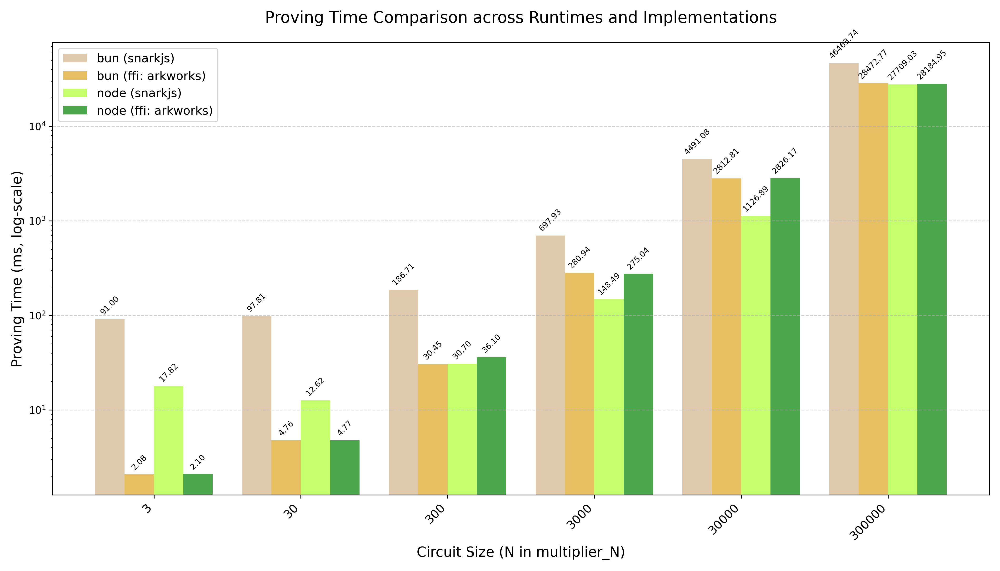

# Benchmarks



We use a simple Python script with `uv` to plot the benchmark results above.

```sh
uv run plot.py
```

The raw results are shown below:

```sh
Using FFI library at /Users/erhant/circomkit-ffi/example/src/libcircomkit_ffi-macOS-arm64.dylib for Bun
Warm-up iteration...

Proving for multiplier_3
Arkworks average time (5 runs): 2.08ms
SnarkJS average time (5 runs): 91.00ms

Proving for multiplier_30
Arkworks average time (5 runs): 4.76ms
SnarkJS average time (5 runs): 97.81ms

Proving for multiplier_300
Arkworks average time (5 runs): 30.45ms
SnarkJS average time (5 runs): 186.71ms

Proving for multiplier_3000
Arkworks average time (5 runs): 280.94ms
SnarkJS average time (5 runs): 697.93ms

Proving for multiplier_30000
Arkworks average time (5 runs): 2812.81ms
SnarkJS average time (5 runs): 4491.08ms

Proving for multiplier_300000
Arkworks average time (5 runs): 28472.77ms
SnarkJS average time (5 runs): 46463.74ms
```

Machine used for these results is a Macbook Air M3, and Bun v1.2.5
